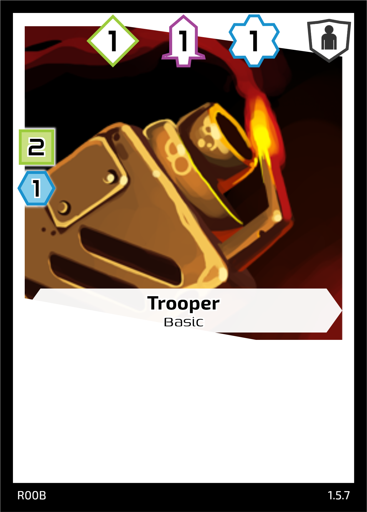
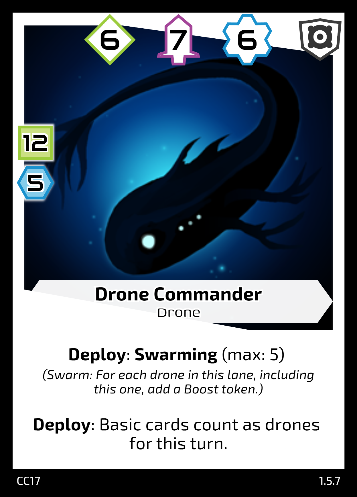

## Base Cards

These the the horizontal formatted cards that denote each of your 3 lanes, Attack, Mining and Tech. The number on the bottom of each card represents your *base power* in that lane. Most abilities and cards that effect a lanes power cannot reduce your power below this base amount.

   

## Faction Cards

   

Each faction has a set of unqiue cards as well. These are more powerful that your Basic Troopers and have unique effects. When constructing a deck, you must use cards from the same faction. If you are unsure, the Faction is the letter part of the card ID in the bottom left corner. The current factions are [R, MM, CC, EF].

### Card Anatomy

Cards consist of 3 main areas, the card values, the cost, and the abilities.

The attack, mining and tech values across the top are the power of the card. These increase the crystals you mine, AKA money, the damage you can do to your opponents hit points, and the technology level of cards you are able to play on subsequent turns.

In order to be able to play a card, you must be able to pay its cost, as well as satisfy its tech level requirements. The cost is a number of crystals that you must currently have in your supply and pay as you play the card. You cannot use crystals gained from the card, or its abilities to pay the cost.

You must also have the required tech level to cover all the cards you are playing this turn. If the card has a tech level of 3, you need at least 3 tech levels at the start of your turn to be able to play it. If you are playing multiple cards, you need enough tech level to cover the sum of all your cards. E.g. If you are playing a Tech 1 and a Tech 3, you need tech level 4 to be able to do so. This resets at the end of turn, and any tech cards played the previous turn count towards your new tech level.

Finally you have abilities. These are actions that happen once on the turn you play the card and have various effects. The card text should explain the ability, but see the definitions below for more information.
