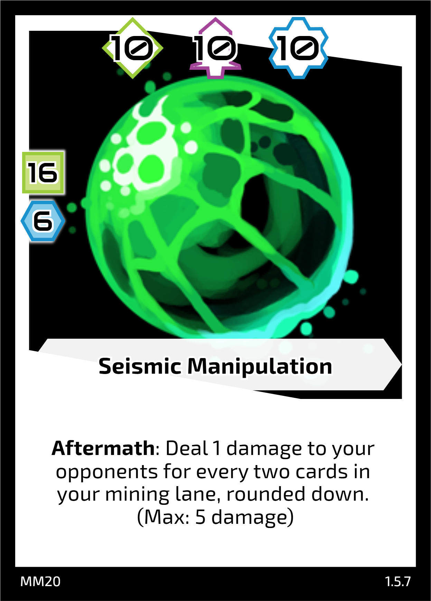
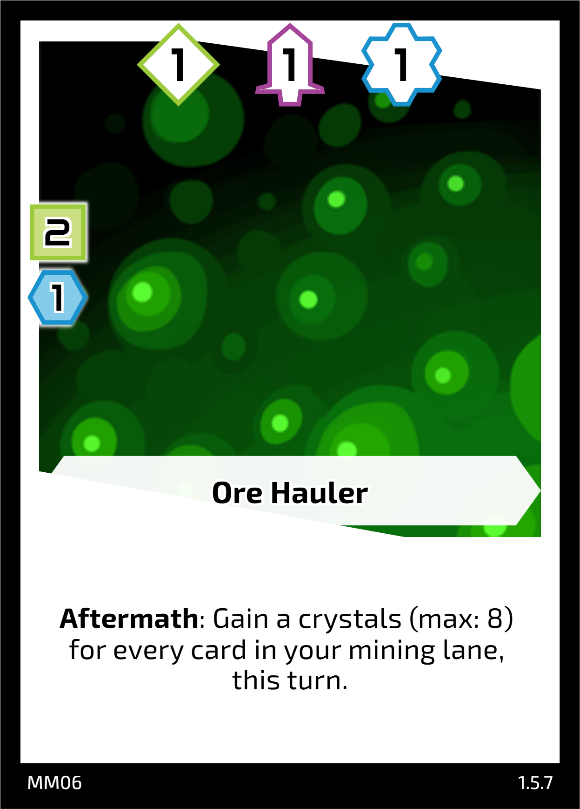
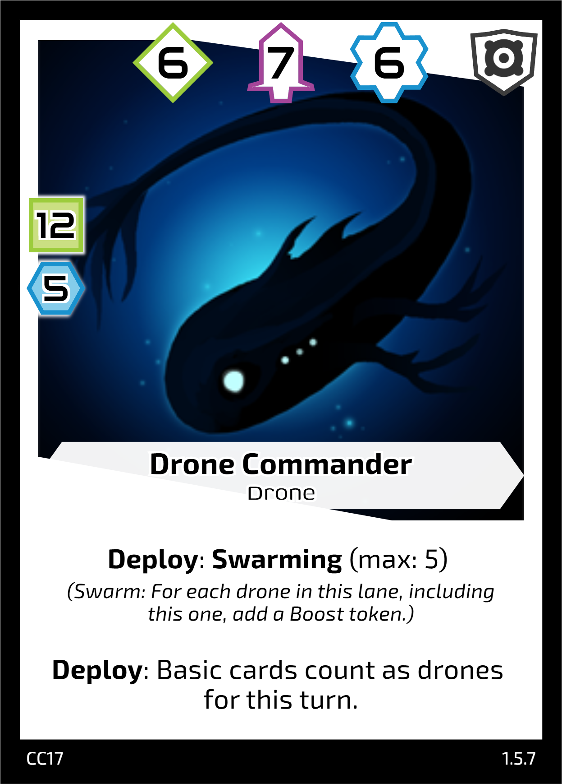
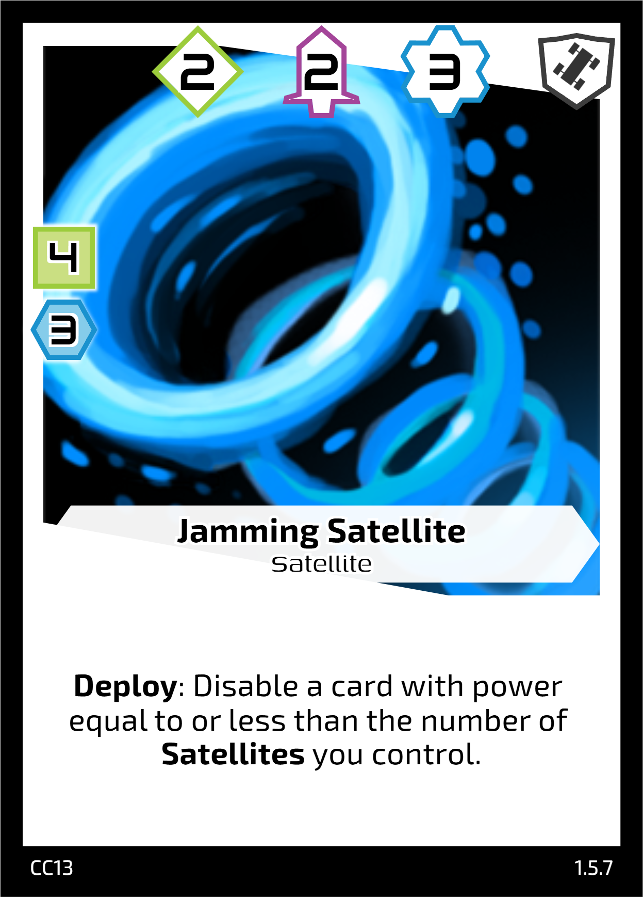
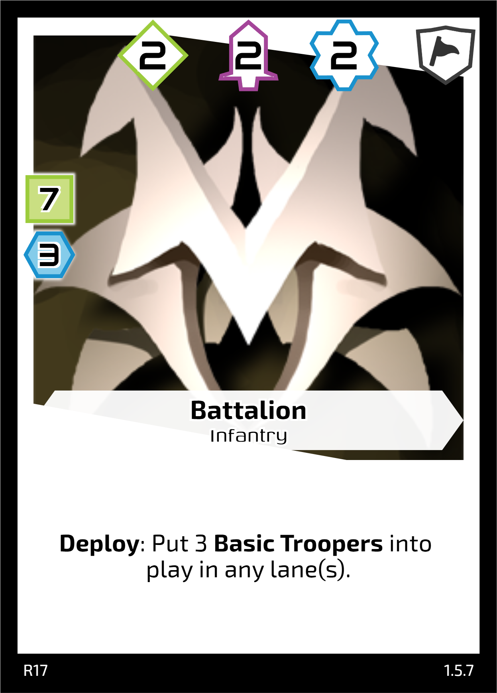
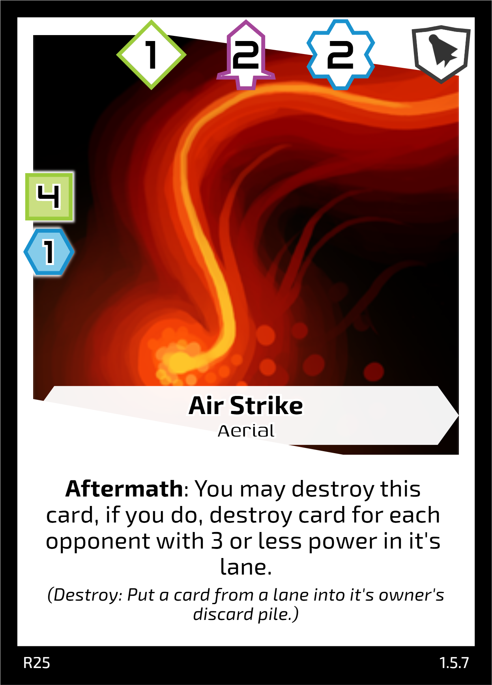

### Megalaxian Mining Consortium

The mining consortium is a large company of money hungry capitalists who scour the galaxy for crystal rich planets to mine. Due to increased agression on their mining routes, it's common for them to employ ex-military troops and battle mechs to defend their operations.

#### Example Cards

#### Key Mechanics

Shift, Split Cost, Gain Crystals

#### Playstyle

Mining-focused, Ramp-up, Combo

#### Speed

Slow-Medium

### Cybernetic Collective

Cybernetic collective of mechanical beings that use crystals as a power source for their large libraries of information. They have advanced drones and satellites that are highly adaptable for mining, research, or destroying their enemies. Their mechanical deign makes them multi-purpose and they can re-deploy their forces rapidly to adapt to the current situation.

#### Example Cards

#### Key Mechanics

Swarming, Reduce Cost, Disable

#### Playstyle

Production-focused, Defensive, Flexible, Temporary Boosts

#### Speed

Slow-Medium

### Caldor's Brigadeers

Rough and ready guerilla warfare. A group of ex-millitary soldier's band together under their commander Caldor to put their skills to use in the pursuit of a big pay-day. Take advantage of their numbers on the ground, or deploy their aerial superiority to take out your enemies and claim the bounty for your crew.

#### Example Cards

#### Key Mechanics

Discard, Return to Hand, Deal Damage

#### Playstyle

Attack-focused, Direct Damage, Cards as a Resource

#### Speed

Fast

## Endracor Federation

Coming soon...
