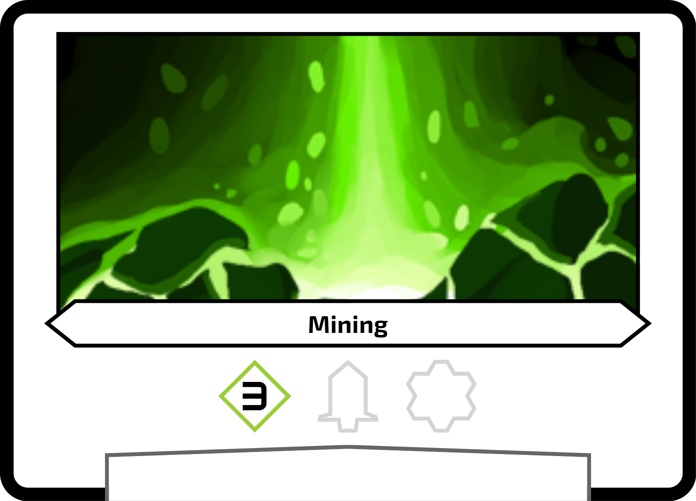
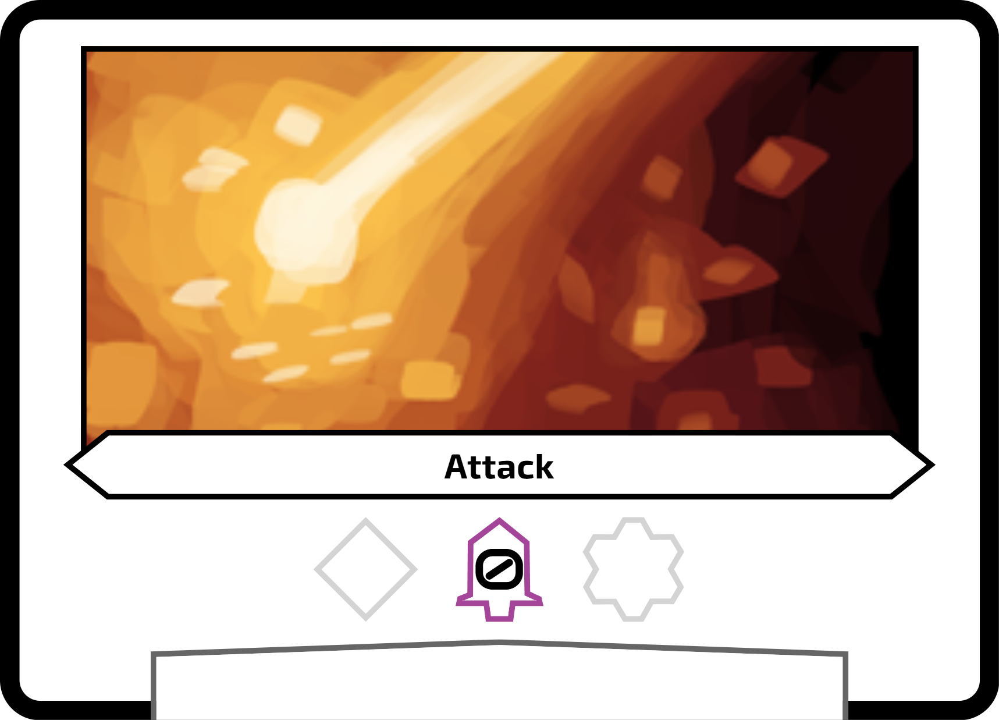
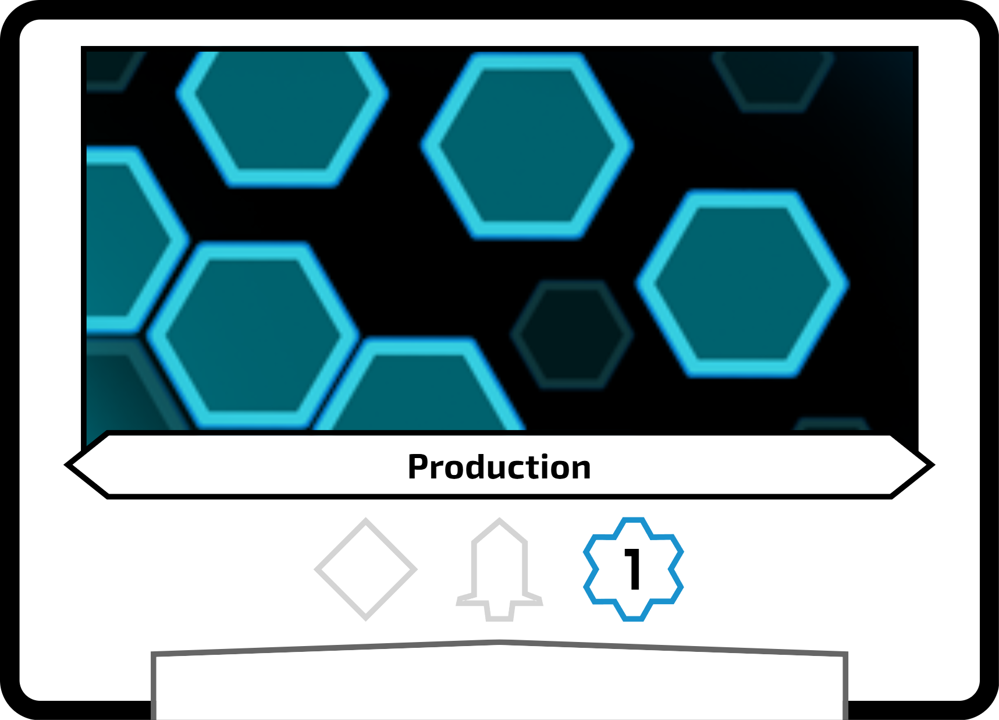
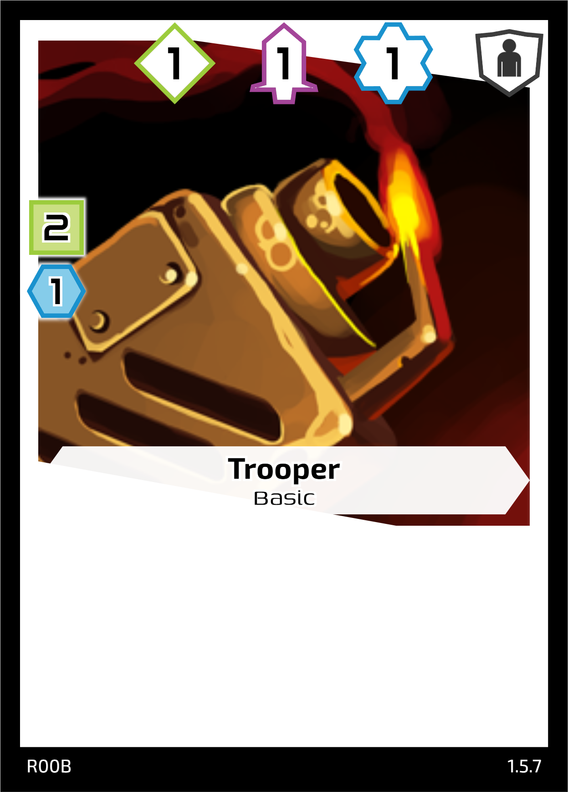
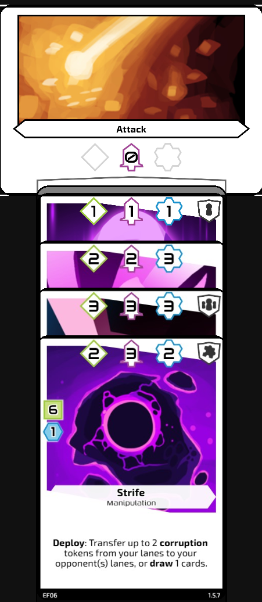
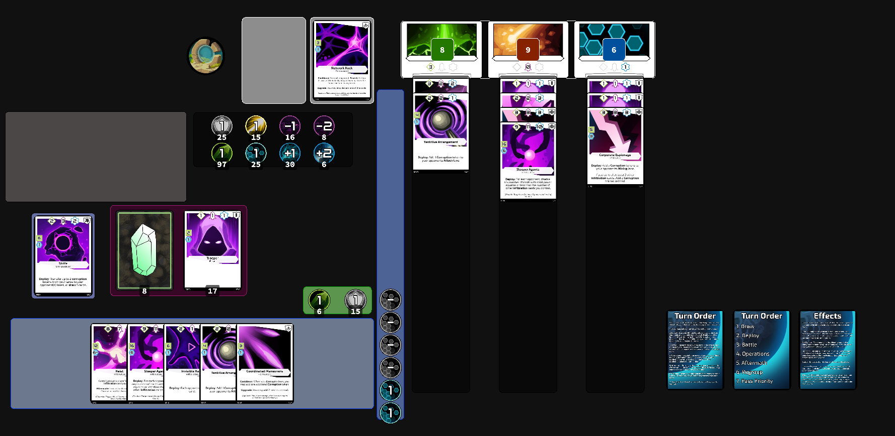

## Overview

Crystal Factions is a sci-fi collectable card game where you battle against other players to secure mining rights for crystals across the galaxy.

The two main objectives to win the game are to reduce the opponents hit points to 0, or have greater than 50 crystals in your supply at end end of the turn.

## Setup

1. Select a **Faction** to play as, and collect their **base cards**, a **faction deck** of 20 faction cards, and **basic deck**. Place any required tokens that apply to your deck, such as **Corruption** or **Boost** tokens on the table within reach of all players.

1. All players place their three **base cards** in the centre of the table to form your three lanes. While it's up to your which order you place your lanes in, generally you will want to match the icons at the top of your cards, with the Mining on the left, Attack in the middle, and Production on the right.

      

1. Place your **basic deck** face up in front of you. Basic cards will all have 1-1-1 as their power and cost 2 crystals and 1 production.

    

1. Shuffle and cut each other’s **faction decks**, and place them face down next to your basic deck.

1. Write down your hitpoint total and starting crystal count, or use counters or dice to track it. Unless otherwise stated, you start with **20 hitpoints**, **3 crystals** and **1 production**.

1. Flip the **priority token**, or another fair, 2-sided coin to determine who has priority first. Place the **priority token** in the play area of the player who won.

## Play Area Diagram

Here is an examlpe setup for your play area. While it's not strictly enforced, it should be made clear to all players where your crystal supply, production, and discard piles are. For another example see the [Screentop layout](#screentopgg) for playing on [screentop.gg](https://screentop.gg/@Direside/crystal-factions).

### Legend

- `@` Priority Token
- `<20>` Hitpoint tracker
- `< >` Crystals
- `(1)` Unused Production token
- `(0)` Used Production token (face side down)
- `[ ]` Lane to play cards into
- `{ }` Permanent Cards

| @      | Mining | Attack | Production | { } { } |
| :----: | :----: | :----: | :--------: | ------: |
|  <20>  | [ ]    | [ ]    | [ ]        |         |
|        | [ ]    | [ ]    | [ ]        |         |
|        | [ ]    | [ ]    | [ ]        | 0       |
| <><><> | [ ]    | [ ]    | [ ]        | 0       |
|        | [ ]    | [ ]    | [ ]        | 0       |
|        | [ ]    | [ ]    | [ ]        | 1       |

## Gameplay

During each turn your will deploy cards from your hand into your 3 lanes to mine crystals, level up your attack, or increase production to allow you to play more cards.

Cards played in the Mining lane increase the number of crystals you gain, the Attack lane increases your attack power to deal damage or defend from opponents, and the production lane unlocks the ability to play more advanced cards and abilities, as well as play more cards on your turn. Balancing how you play out your hand will determine who claims the planet and it's precious crystals.

### Start of Game

Draw 6 cards, and then keep 3. Shuffle the remaining 3 cards back into your faction deck.

Skip the draw step on your first turn.

### Turn Order (Phases)

1. Draw - Each player may draw 1 from their faction deck.

2. Deploy - Starting with the player with the priority token, play cards from your hand and pay their costs. Activate PLAY abilities immediately after playing the card. Once a player has played all the cards and abilities they want for the round, move to the next player clockwise.

    For help identifying the different parts of a card, see [Card Anatomy](./components.md#card-anatomy).

3. Battle - Calculate the Attack Power (AP) for all players. Players with lower AP take the difference in damage between their own AP, and the player with the most AP.

4. Operations - Each player calculates their Mining Power and gains that many crystals. Each player calculates their Production Power and resets their production tokens to that number.

5. Aftermath - Starting with the player with the priority token, resolve all the END abilities for cards played this turn. Players may choose the order of their own activations.

6. Regroup - Reset any Cooldown abilities, remove disable from all cards, and remove temporary tokens from your lanes. You can also use this phase to stack you cards in the lane and reduce space.

7. Pass Priority - Move the Priority token to the player to your left.

## Stacking Cards

Cards in Crystal Factions are designed to allow you to stack them on top of each other, with only the top row showing after the turn you play them.

All text on the cards is activated on the turn you play it, so covering the text for following turns is fine, even for new players. Card types are represented by the icon in the top right and can be used to quickly identify cards of a certain type you control in your lanes.

Text on played cards is public knowledge, so if asked you must show a card and it's text to an opponent when requested.

## Screentop.gg

To reduce scrolling around the page, we use a slightly different layout on screentop compared to the one listed above. This layout has the discard pile to the left of the faction deck, and also moves the permanent cards and production track to the left as well.

