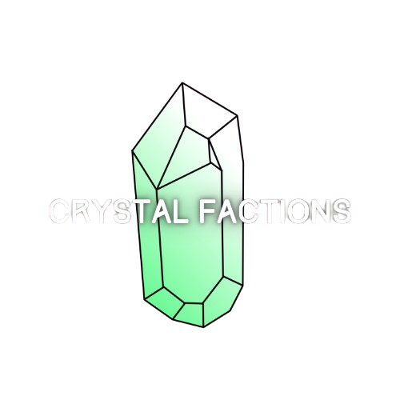
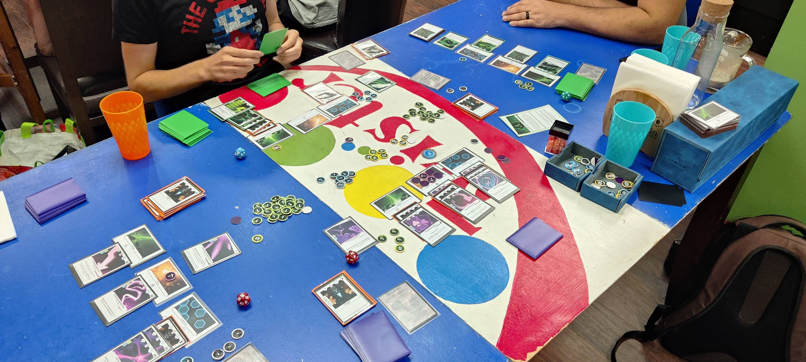

Crystal Factions is a card battle game for 1-4 players with pre-made decks to get you right into the action. You play as one of the Factions of space-faring civilizations who rely on energy crystals as a power source and a currency. The battle takes place on a mineral rich planet where you and you opponents all try and mine the most crystals or just destroy your enemies and claim the planet for yourselves.

Gameplay revoles around deploying cards to mine crystals, level up your attack, or research advanced technology. Each card has a crystal cost and a tech requirement, so investing in mining and technology is key to being able to play your more powerful cards. Don't neglect attack though, your base can only sustain so much damage before you are destroyed and out of the game.

## Rules

See [Game Rules](./game_rules.md) for how to play!

## Play the Game

Join the [Crystal Factions Discord](https://discord.gg/rnrGySzGNd) server to see when the next playtest session is!

## Feedback

This game is still in active development and feedback is welcome. See the Discord link above to join and leave feedback in our #feedback channel. For recent changes, see the latest [patch notes](./patch_notes/latest.md)
